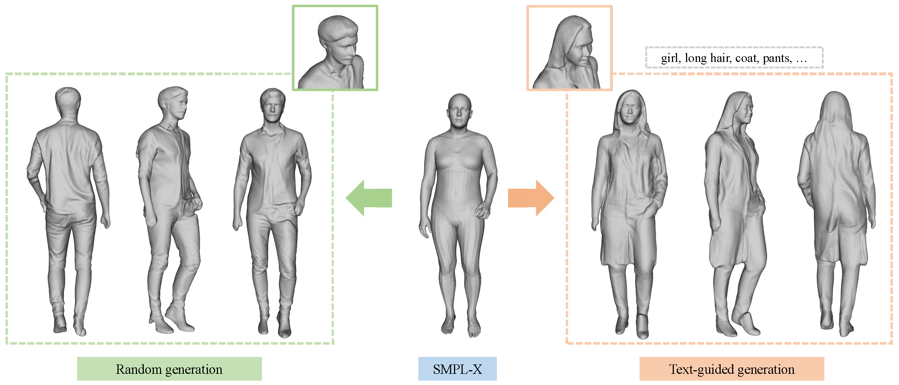
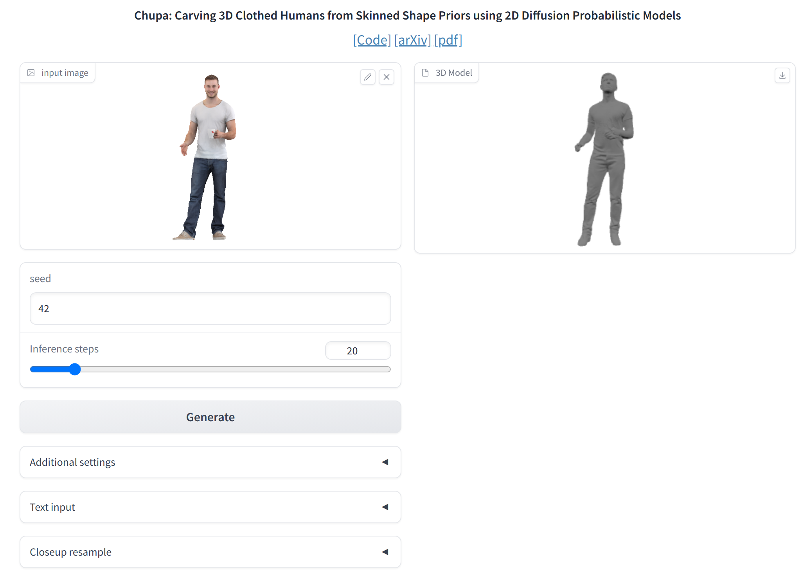

# Chupa

## [Project Page](https://snuvclab.github.io/chupa/) &nbsp;|&nbsp; [Paper](https://arxiv.org/pdf/2305.11870.pdf) 



This is the official code for the ICCV 2023 paper "Chupa: Carving 3D Clothed Humans from Skinned Shape Priors using 2D Diffusion Probabilistic Models", a 3D generation pipeline specialized on generating realistic human digital avatars.

## Installation
Setup the environment using conda.
```
conda env create -f environment.yaml
conda activate chupa
```
Please check the installed pytorch has correct cuda version depending on your gpu.

#### Install pyremesh
```
python -m pip install --no-index --find-links ./src/normal_nds/ext/pyremesh pyremesh
```

### Get SMPL related data
Following the instructions from [ECON](https://github.com/YuliangXiu/ECON/blob/master/docs/installation-ubuntu.md), you should register [ICON website](https://icon.is.tue.mpg.de/).
Then, please run the script originally from [ECON](https://github.com/YuliangXiu/ECON/tree/master).
```
bash scripts/fetch_data.sh
```


### Install frankmocap (Optional, for running Gradio)
```
mkdir third_party
cd third_party
git clone https://github.com/facebookresearch/frankmocap.git
cd frankmocap
sh scripts/install_frankmocap.sh
mv extra_data ../../  # for relative path problem

# create setup.py and install frankmocap
echo "from setuptools import find_packages, setup

setup(
    name='frankmocap',
    packages=find_packages('.'),
    package_dir={'': '.'},
)" > ./setup.py
pip install -e .
```

## Training
Training code will be released soon.
### Pretrained Model
At the moment, you can get the pretrained checkpoints by running the commands below.
The checkpoints include autoencoder checkpoints from [Latent Diffusion Model](https://github.com/CompVis/latent-diffusion).
```
gdown https://drive.google.com/uc?id=1F2104jQM_bN_GC964sOXZ4-QEatqPfuo  # Models for dual normal map generation
unzip checkpoints.zip && rm checkpoints.zip
mkdir checkpoints/autoencoder/vq-f4-c3 && cd checkpoints/autoencoder/vq-f4-c3
wget https://ommer-lab.com/files/latent-diffusion/vq-f4.zip  # Autoencoder checkpoint from latent diffusion
unzip vq-f4.zip && rm vq-f4.zip 
```

## Inference
### Run Chupa on Gradio
You can upload an image of a person, then frankmocap will predict the SMPL-X parameter of it.  
Based on the predicted parameter, Chupa pipeline will generate a 3D human avatar (takes a few minutes).
(Note: Please ensure that the uploaded image contains one person.)
```
python scripts/gradio.py configs/gradio.yaml
```


### Run Chupa on Terminal
#### Getting Data
You can get the test SMPL-X parameters for the test split of renderpeople dataset.
```
mkdir data && cd data
gdown https://drive.google.com/uc?id=1pWsSEUIoHF_4Zjn_2OczC9FKdLjChWDY
unzip renderpeople.zip && rm renderpeople.zip
```
We followed the data split of [PIFuHD](https://github.com/facebookresearch/pifuhd/tree/main/data), and we release the SMPL-X parameters for test split at the moment. Please unzip it and follow the tree below.
```
./data/
├── renderpeople/
│   └── smplx/
│       └── rp_ben_posed_001.pkl
│       └── ...
```
You may checkout [THuman2.0](https://github.com/ytrock/THuman2.0-Dataset) for getting SMPL-X parameters for THuman2.0 dataset. We used `0473~0525` as test split.
#### Random generation
This will generate random 3D avatars based on SMPL-X parameters in `data/renderpeople/smplx`.
```
python scripts/chupa.py configs/random.yaml
```
Specify a subject in dataset
```
python scripts/chupa.py configs/random.yaml dataset subject=rp_ben_posed_001
``` 

#### Text-guided generation
This will generate 3D avatars based on the given prompt and SMPL-X parameters in `data/renderpeople/smplx`. 
```
python chupa.py --config configs/text.yaml chupa.prompt=${Your Prompt}
```

## Citation

If you use this code for your research, please cite our paper:


```
@misc{kim2023chupa,
      title={Chupa: Carving 3D Clothed Humans from Skinned Shape Priors using 2D Diffusion Probabilistic Models}, 
      author={Byungjun Kim and Patrick Kwon and Kwangho Lee and Myunggi Lee and Sookwan Han and Daesik Kim and Hanbyul Joo},
      year={2023},
      eprint={2305.11870},
      archivePrefix={arXiv},
      primaryClass={cs.CV}
}
```

## Thanks to
- https://github.com/CompVis/latent-diffusion
- https://github.com/fraunhoferhhi/neural-deferred-shading
- https://github.com/YuliangXiu/ECON.git
- https://github.com/YuliangXiu/ICON.git
- https://github.com/facebookresearch/frankmocap
- https://github.com/crowsonkb/k-diffusion.git